<h1>🤑 Создание прототипа базы данных для банковской системы</h1>

Проектная работа по дисциплине майнор «Введение в базы данных» студентов НИУ ВШЭ группы ИАД2

## 🛠 Технологический стек

<div align="center">

### 🗄️ **База данных**


### 🚀 **Бэкенд**


### 🐳 **Инфраструктура**


</div>

<h3>😎 Выполнили:</h3>

- Ванченко Александра ИАД2
- Глебушкина Юлия ИАД2  
- Нороха Нестор ИАД2
- Федоров Матвей ИАД2
- Швырев Андрей ИАД2

<h3>Дата: 22.11.2025</h3>

<h2>✍️ Содержание </h2>

1. [Применение и назначение](#применение-и-назначение)
2. [Функциональные требования](#функциональные-требования)
3. [Нефункциональные требования](#нефункциональные-требования)

<h2>🧑‍💻 Применение и назначение</h2>

Наша команда поставила цель разработать базу данных для банковской системы, приближенную к реальной реализации. В ходе работы было определено, что проект должен не только обеспечивать создание банковских транзакций и хранение информации о них, но и реализовать отдельный функционал для юридических лиц. Командный анализ показал, что сущность юр. лица настолько отличается от сущности физ. лица, что осмысленно реализовать её отдельно.


## 📁 Структура проекта

```
.
├── 📄 README.md                          - Основная документация
├── 📄 docker-compose.yaml                - Docker Compose конфигурация
├── 📁 db-service/                        - Go сервис базы данных
├── 📁 migrations/                        - Миграции БД
├── 📁 queries/                           - SQL запросы по категориям
├── 📁 sql/                               - SQL скрипты создания схемы
├── 📁 monitoring/                        - Мониторинг (Grafana)
└── 📁 configs/                           - Конфигурационные файлы
```

## 🔧 Основные директории

| Директория | Назначение |
|------------|------------|
| **`db-service/`** | Go-сервис для работы с базой данных |
| **`migrations/`** | Миграции схемы базы данных |
| **`queries/`** | SQL запросы для бизнес-операций |
| **`sql/tables/`** | SQL скрипты создания таблиц |
| **`monitoring/`** | Конфигурация мониторинга (Grafana) |
| **`configs/`** | Файлы конфигурации |

## 🚀 Быстрый старт

```bash
# Клонирование репозитория
git clone <repository-url>
cd banking-system

# Запуск контейнеров
docker-compose up -d

# Применение миграций
cat migrations/20251127123059_tables_management.up.sql | psql -U postgres -d banking_db
```



<h2>🎯 Основные направления использования:</h2>

<h3>👥 1. CRUD операции</h3>

```mermaid
erDiagram

    %% ========== ОСНОВНЫЕ СУЩНОСТИ ==========
    
    Individual {
        SERIAL id PK
        VARCHAR first_name
        VARCHAR surname
        VARCHAR patronymic
        VARCHAR INN UK
        INT passport_series
        INT passport_nums
        VARCHAR phone_num UK
        VARCHAR password
        TIMESTAMP created_at
    }

    LegalEntity {
        SERIAL id PK
        VARCHAR name UK
        VARCHAR INN UK
        TIMESTAMP created_at
        INT owner_id FK
    }

    MainAccount {
        SERIAL id PK
        INT user_id FK
        VARCHAR BIC
        INT agreement_num UK
        TIMESTAMP created_at
    }

    %% ========== СПРАВОЧНИКИ И ТИПЫ ==========
    
    TransactionType {
        SERIAL id PK
        TIMESTAMP created_at
        VARCHAR name
    }

    StockTypes {
        SERIAL id PK
        VARCHAR type_name
    }

    StockTransactionTypes {
        SERIAL id PK
        VARCHAR operation_name
    }

    resident_status {
        STRING resident
        STRING non-resident
    }

    ACCOUNT_STATUS {
        STRING active
        STRING frozen
        STRING closed
    }

    %% ========== ВАЛЮТЫ И КУРСЫ ==========
    
    SettlementCurrency {
        SERIAL id PK
        TIMESTAMP created_at
        TIMESTAMP updated_at
        VARCHAR ticker UK
        VARCHAR country
    }

    UserCurrency {
        SERIAL id PK
        VARCHAR ticker UK
        VARCHAR country
        TIMESTAMP updated_at
    }

    ExchangeRate {
        SERIAL id PK
        TIMESTAMP created_at
        TIMESTAMP updated_at
        INT settlement_id FK
        DECIMAL ratio
        INT currency_from FK
        BOOLEAN is_current
        INT currency_to FK
    }

    %% ========== АКЦИИ И ЦЕНЫ ==========
    
    Stocks {
        SERIAL id PK
        TIMESTAMP registered_at
        INT stock_type FK
        VARCHAR ticker UK
    }

    StockPrices {
        SERIAL id PK
        TIMESTAMP updated_at
        INT stock_id FK
        NUMERIC price
    }

    %% ========== СЧЕТА ФИЗИЧЕСКИХ ЛИЦ ==========
    
    DebutAccount {
        SERIAL id PK
        VARCHAR BIC
        INT agreement_num UK
        TIMESTAMP created_at
        INT main_account_num FK
        INT currency_id FK
        VARCHAR card_num UK
        INT card_validity
        INT CVV
        DECIMAL amount
    }

    BrokerageAccount {
        SERIAL id PK
        VARCHAR BIC
        INT agreement_num UK
        TIMESTAMP created_at
        INT main_account_num FK
        VARCHAR depository
        resident_status tax_resident_status
        INT depot_account_num UK
    }

    LoanAccount {
        SERIAL id PK
        VARCHAR BIC
        INT agreement_num UK
        TIMESTAMP created_at
        INT main_account_num FK
        INT currency_id FK
        VARCHAR card_num UK
        INT card_validity
        INT CVV
        DECIMAL bet
        INT repayment_period
        DECIMAL limit_amount
    }

    SavingsAccount {
        SERIAL id PK
        VARCHAR bic UK
        INT agreement_num UK
        TIMESTAMP created_at
        INT main_account_num FK
        INT currency_id FK
        DECIMAL bet
        DECIMAL amount
    }

    %% ========== СЧЕТА ЮРИДИЧЕСКИХ ЛИЦ ==========
    
    SettlementAccount {
        SERIAL id PK
        TIMESTAMP created_at
        INT settlement_id FK
        INT currency_id FK
        DECIMAL balance
        ACCOUNT_STATUS status
    }

    ForeignCurrencyAccount {
        SERIAL id PK
        TIMESTAMP created_at
        INT settlement_id FK
        DECIMAL balance
        ACCOUNT_STATUS status
        INT currency_id FK
    }

    CreditAccount {
        SERIAL id PK
        TIMESTAMP created_at
        INT settlement_id FK
        DECIMAL balance
        ACCOUNT_STATUS status
        INT currency_id FK
    }

    %% ========== КОМИССИИ И ТАРИФЫ ==========
    
    EntityPaymentFee {
        SERIAL id PK
        TIMESTAMP created_at
        INT settlement_id FK
        DECIMAL ratio
        DECIMAL absolute
        INT type_id FK
    }

    UserPaymentFee {
        SERIAL id PK
        TIMESTAMP created_at
        INT trans_type FK
        INT account_id FK
        NUMERIC ratio
        NUMERIC absolute
    }

    %% ========== ТРАНЗАКЦИИ И ОПЕРАЦИИ ==========
    
    Transactions {
        SERIAL id PK
        INT recipient_acc FK
        INT sender_acc FK
        INT type_id FK
        TIMESTAMP date_transaction
        VARCHAR currency
        INT comission_id FK
        DECIMAL amount
    }

    SettlementPaymentTransactions {
        SERIAL id PK
        TIMESTAMP created_at
        INT fee_id FK
        INT account_id FK
        DECIMAL primary_amount
        INT type_id FK
    }

    CreditTransactions {
        SERIAL id PK
        TIMESTAMP created_at
        INT fee_id FK
        INT account_id FK
        DECIMAL primary_amount
        INT type_id FK
    }

    SettlementExchangeTransactions {
        SERIAL id PK
        TIMESTAMP created_at
        INT fee_id FK
        INT rate_id FK
        INT account_id FK
        DECIMAL primary_amount
        INT type_id FK
    }

    StockTransactions {
        SERIAL id PK
        TIMESTAMP created_at
        INT stock_id FK
        INT account_id FK
        INT operation_type_id FK
        NUMERIC value
        INT stock_price_id FK
    }

    UserStock {
        SERIAL id PK
        INT transact_id FK
        INT brock_acc_num FK
    }

    %% ========== ОСНОВНЫЕ СВЯЗИ ==========
    
    Individual ||--o{ LegalEntity : "владеет"
    Individual ||--o{ MainAccount : "имеет"
    
    MainAccount ||--o{ DebutAccount : "содержит"
    MainAccount ||--o{ BrokerageAccount : "содержит"
    MainAccount ||--o{ LoanAccount : "содержит"
    MainAccount ||--o{ SavingsAccount : "содержит"
    
    LegalEntity ||--o{ SettlementAccount : "имеет"
    LegalEntity ||--o{ ForeignCurrencyAccount : "имеет"
    LegalEntity ||--o{ CreditAccount : "имеет"
    LegalEntity ||--o{ EntityPaymentFee : "устанавливает тарифы"
    LegalEntity ||--o{ ExchangeRate : "устанавливает курсы"
    
    MainAccount ||--o{ UserPaymentFee : "имеет тарифы"
    MainAccount ||--o{ Transactions : "как отправитель"
    MainAccount ||--o{ Transactions : "как получатель"
    
    TransactionType ||--o{ EntityPaymentFee : "для типа"
    TransactionType ||--o{ UserPaymentFee : "для типа"
    TransactionType ||--o{ Transactions : "определяет тип"
    TransactionType ||--o{ SettlementPaymentTransactions : "определяет тип"
    TransactionType ||--o{ CreditTransactions : "определяет тип"
    TransactionType ||--o{ SettlementExchangeTransactions : "определяет тип"
    
    EntityPaymentFee ||--o{ SettlementPaymentTransactions : "в транзакциях"
    EntityPaymentFee ||--o{ CreditTransactions : "в транзакциях"
    EntityPaymentFee ||--o{ SettlementExchangeTransactions : "в транзакциях"
    
    UserPaymentFee ||--o{ Transactions : "с комиссией"
    
    SettlementAccount ||--o{ SettlementPaymentTransactions : "имеет транзакции"
    CreditAccount ||--o{ CreditTransactions : "имеет транзакции"
    ForeignCurrencyAccount ||--o{ SettlementExchangeTransactions : "имеет транзакции"
    
    ExchangeRate ||--o{ SettlementExchangeTransactions : "по курсу"
    
    SettlementCurrency ||--o{ ExchangeRate : "как исходная валюта"
    SettlementCurrency ||--o{ ExchangeRate : "как целевая валюта"
    SettlementCurrency ||--o{ DebutAccount : "валюта счета"
    SettlementCurrency ||--o{ LoanAccount : "валюта счета"
    SettlementCurrency ||--o{ SettlementAccount : "валюта счета"
    SettlementCurrency ||--o{ ForeignCurrencyAccount : "валюта счета"
    SettlementCurrency ||--o{ CreditAccount : "валюта счета"
    
    UserCurrency ||--o{ SavingsAccount : "валюта счета"
    
    StockTypes ||--o{ Stocks : "классифицирует"
    Stocks ||--o{ StockPrices : "имеет цены"
    Stocks ||--o{ StockTransactions : "в операциях"
    
    StockPrices ||--o{ StockTransactions : "по цене"
    StockTransactionTypes ||--o{ StockTransactions : "тип операции"
    
    SavingsAccount ||--o{ StockTransactions : "совершает операции"
    StockTransactions ||--o{ UserStock : "записывается в"
    BrokerageAccount ||--o{ UserStock : "хранит акции"
```

1. Новый клиент (физ/юр.лицо)
2. Обновление данных (смена паспорта/названия компании)
3. Откат (уход) клиента

<h3>👤 2. Ведение банкинга физических лиц</h3>

1. Создание счетов разных типов
2. Закрытие счетов разных типов
3. Ведение инвестиций
4. Денежные переводы

<h3>🏢 3. Обслуживание юридических лиц</h3>

1. Банковский эквайринг
2. Выплата заработных плат*
3. Ведение счетов компании
4. Реализация связи юридического и физического лица

<small>*Здесь и далее под выплатой заработных плат подразумеваются специфичные операции с расчётным счётом</small>

<h2>📋 Функциональные требования</h2>

<h3>👤 1. Операции с клиентами</h3>

<h4>Регистрация:</h4>

1. Физического лица
2. Юридического лица

<h4>Обновление данных:</h4>

1. Изменение паспортных данных / данных Юридического лица
2. Изменение контактной информации

<h4>Удаление клиентов:</h4>

1. Уход клиента (закрытие счетов)

<h2>🏦 2. Банкинг физических лиц</h2>

<h4>Ведение счетов:</h4>

1. Создание и закрытие счетов разных типов
2. Хранение текущего баланса
3. Привязка счета к клиенту
4. Возможность ведения счёта в разных валютах

<h4>Переводы:</h4>

1. Переводы между счетами одного клиента
2. Переводы между счетами разных клиентов
3. Логирование транзакций

<h2>🏢 3. Банкинг юридических лиц</h2>

<h4>Эквайринг:</h4>

1. Проведение операций
2. Комиссионные списания
3. Регистрацию предприятий

<h4>Выплата заработных плат:</h4>
  
1. Заявки на выплаты
2. Списания со счёта компании на выплату заработных плат
3. Логирование операций

<h4>Корпоративные счета:</h4>

1. Создание разных типов счетов
2. Ведение операций по разным счетам
3. Возможное внедрение прав доступа

<h2>🤓 Нефункциональные требования </h2>

1. *Хранение информации об операциях* (логирование)
2. *Реализация прав доступа* - обновлять важную информацию смогут не все
3. *Валютные ограничения* - переводы возможны между счетами одной валюты
4. *Баланс клиента* не отрицателен (за исключением кредитных списаний)
5. *Проверка счетов* при удалении клиента
6. *Производительность* - система должна обеспечивать массовые операции без критических задержек
7. *Эффективный поиск* - выполняется за разумное время без остановки базы данных
8. *Масштабируемость* - архитектура подразумевает возможность дальнейшего расширения
- *Отказоустойчивость* - при сбоях система не должна останавливать работу
- *Аналитика* - проект подразумевает возможность порождения аналитических запросов
- *Надёжность* - сохранение информации об операциях происходит вне зависимости от результата
